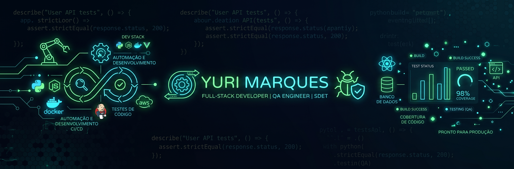

<div align="center">


# 👋Olá!

<p align="center">
  <strong>Desenvolvimento Web • Automação • QA • Testes de Software</strong>
</p>

<p align="center">
  🎓 Estudante de Análise e Desenvolvimento de Sistemas
  <br>
  💻 Construindo projetos e aprimorando minhas habilidades em tecnologia
  <br>
  🧪 Foco atual em Qualidade de Software e Testes
</p>

<br>

<a href="https://github.com/yurimarques21">
  
</a>

<a href="https://www.linkedin.com/in/yuri-marques1">
  
</a>

</div>

## 🐍 Minhas contribuições

<div align="center">

<picture>
  <source
    media="(prefers-color-scheme: dark)"
    srcset="https://raw.githubusercontent.com/yurimarques21/yurimarques21/output/github-contribution-grid-snake-dark.svg"
  />
  <source
    media="(prefers-color-scheme: light)"
    srcset="https://raw.githubusercontent.com/yurimarques21/yurimarques21/output/github-contribution-grid-snake.svg"
  />
  

</picture>

</div>

---

## 👨‍💻 Sobre mim

🎓 Atualmente curso **Análise e Desenvolvimento de Sistemas**, construindo minha trajetória profissional na área de Tecnologia.

Meu foco está na combinação entre **Desenvolvimento Web, Automação de Processos e Qualidade de Software**, buscando entender não apenas como desenvolver uma solução, mas também como **testá-la, identificar problemas e melhorar continuamente sua qualidade**.

Tenho interesse especial por:

- 🌐 Desenvolvimento Web
- ⚙️ Automação de processos e fluxos
- 🧪 Qualidade de Software e testes
- 🤖 Automação e novas tecnologias
- 🧩 Soluções Low-Code
- 🧠 Lógica de programação e resolução de problemas
- 📚 Aprendizado contínuo

Gosto de transformar problemas em soluções práticas, entender como os sistemas funcionam e buscar maneiras de tornar processos mais eficientes, confiáveis e organizados.

> 🚀 **Meu objetivo é evoluir constantemente, transformando conhecimento em projetos e experiência prática.**

---

# 🛠️ Tecnologias & Ferramentas

### 💻 Desenvolvimento

<p>
  
</p>

### 🔧 Ferramentas

<p>
  
</p>

### 🧪 QA & Gestão

<p>


</p>

---

# 🧪 Qualidade de Software

Tenho direcionado parte dos meus estudos para **QA e testes de software**, desenvolvendo conhecimentos em:

- ✅ Testes funcionais
- 🔍 Testes exploratórios
- 📝 Criação de casos e cenários de teste
- 🐞 Identificação e documentação de bugs
- 📋 Validação de requisitos
- 🔄 BDD
- 🥒 Gherkin
- 🔌 Testes de API com Postman
- 📊 Testes de desempenho com JMeter
- 🛠️ Análise utilizando DevTools
- 🤖 Fundamentos de automação de testes

Meu objetivo é unir **desenvolvimento + qualidade**, entendendo o software desde sua construção até sua validação.

---

# ⚙️ Automação & Low-Code

Tenho interesse crescente em **automação de processos e soluções Low-Code**, principalmente na criação de fluxos capazes de reduzir tarefas repetitivas e tornar processos mais eficientes.

Atualmente estou expandindo meus conhecimentos nessa área, buscando compreender:

```text
Problema
   ↓
Análise do processo
   ↓
Definição da solução
   ↓
Automação
   ↓
Testes
   ↓
Validação
   ↓
Melhoria contínua

 
---
